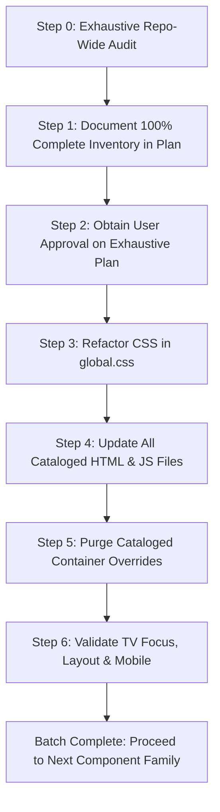

# Object-Oriented CSS (OOCSS) Step-by-Step Refactoring Workflow

This workflow defines the standardized, repeatable protocol for systematically refactoring the styling and markup of the IVIDS application into **Object-Oriented CSS (OOCSS)**.

Refactoring MUST be executed **step-by-step, one component family per batch** (e.g. Buttons $\to$ Posters/Cards $\to$ Modals $\to$ Form Controls $\to$ Navigation $\to$ Rails/Grids). Each batch includes simultaneously refactoring the CSS rules, updating **all** related HTML templates and dynamic JavaScript renderers, and purging obsolete container overrides.

---

## 🎯 Core Goals & Benefits

1. **Drastic Code Reduction**: Eliminates dozens of duplicated container overrides (e.g., `.modal-footer .btn`, `.error-actions .btn`) by using reusable modifier classes and composable container objects.
2. **Accelerated Rendering Performance**: Replaces deep descendant selectors ($O(depth)$ tree traversal) with direct single-class matching ($O(1)$ lookup in Chromium), delivering faster Style Recalculation on Android TV and Tizen.
3. **Strict OOP Modularity**: Clear separation of **Structure from Skin** and **Container from Content**.
4. **Preserved TV Standards**: Strict compliance with `.focusable` spatial navigation, standard thick white focus borders, and prohibition of hover/focus transforms (`scale`, `translateX`, `translateY`).

---

## 🏗️ The OOP Architecture Contract

Every component family is structured into 5 distinct OOP layers:

| Layer | OOP Role | Naming Convention | Examples (Buttons) |
| :--- | :--- | :--- | :--- |
| **1. Base Class** | Abstract Structural Superclass (Display, geometry, alignment, typography reset, transitions). No colors or themes. | `.<component>` | `.btn`, `.card`, `.modal` |
| **2. Structural Subclasses** | Size, shape, and layout specializations. | `.<component>--<size>`, `.<component>--<shape>` | `.btn--sm`, `.btn--lg`, `.btn--circle`, `.btn--block` |
| **3. Skin Variants** | Visual themes (Backgrounds, border colors, shadows, text colors). | `.<component>--<theme>` | `.btn--primary`, `.btn--secondary`, `.btn--danger`, `.btn--ghost` |
| **4. State Modifiers** | Interactive and behavioral states (Focus, active, disabled). | `:<pseudo>`, `.<component>.is-<state>` | `.btn:focus`, `.btn.focused`, `.btn.is-active`, `.btn.is-disabled` |
| **5. Container Objects** | Composite layout objects governing arrangements of children (Decouples container from content). | `.<component>-<layout>` | `.btn-group`, `.btn-group--fill`, `.btn-group--vertical` |

---

---

## ⚠️ MANDATORY ZERO-OMISSION PRE-AUDIT RULE

> [!CAUTION]
> **STRICT ZERO-OMISSION INVARIANT**: Before modifying ANY files or writing any code, the agent MUST produce an **exhaustive, 100% complete implementation plan** listing EVERY single item that will be touched:
> - **Every CSS class and selector** (base, subclasses, skins, containers, legacy aliases to be removed).
> - **Every file path** (HTML templates, JS controllers, CSS files).
> - **Every line number and code snippet** where the component is used across the ENTIRE repository.
>
> If even **A SINGLE file, class, or instance is missed** in the plan and discovered as an afterthought during execution (*"ah, we also need to change this..."*), the task preparation is officially considered **DEFECTIVE AND FAILED**. The plan MUST contain the entire universe of changes upfront with zero omissions.

---

## 📋 The 6-Step Component Refactoring Protocol

For every single component batch, execute these 6 steps in strict sequential order. **DO NOT start the next component batch until the current batch passes all checks!**



### Step 1: Exhaustive Repo-Wide Audit & Plan Itemization
1. **Exhaustive CSS Audit**: Grep for every existing class, pseudo-class, and descendant selector for the target component in [app/src/main/assets/main/gui/css/global.css](file:///c:/Users/kenji/Documents/PROJECTS/IVIDS/IVIDS/app/src/main/assets/main/gui/css/global.css) and [global-mobile.css](file:///c:/Users/kenji/Documents/PROJECTS/IVIDS/IVIDS/app/src/main/assets/main/gui/css/global-mobile.css).
2. **Exhaustive Markup Audit**: Search all `.html` templates under `app/src/main/assets/main/gui/pages/`, `components/`, and root for EVERY occurrence of the component.
3. **Exhaustive Dynamic JS Audit**: Search all `.js` files under `app/src/main/assets/main/gui/pages/` and `js/` where dynamic HTML strings, template literals, or DOM creation APIs touch this component.
4. **Itemize in Implementation Plan**: Explicitly document every file path, line number, and element in the plan. Verify that the sum of occurrences matches repo search results with 100% parity before requesting user review.
5. **Identify Container Overrides**: Catalog every descendant selector (e.g., `.modal-footer .btn`, `.login-card .btn`, `.error-actions .btn`) that will be purged.

### Step 2: Design OOP Decomposition
Map out the target component into the 5 OOCSS layers:
- What belongs in the pure structural Base Class?
- What are the sizing and shape subclasses?
- What are the color/skin variants?
- What are the states (especially D-pad focus indicator: thick white border)?
- What composable container classes (e.g. `.component-group`) are needed to eliminate descendant hacks?

### Step 3: Refactor CSS in `global.css`
1. **Centralized Location**: Write the new OOCSS rules inside [global.css](file:///c:/Users/kenji/Documents/PROJECTS/IVIDS/IVIDS/app/src/main/assets/main/gui/css/global.css).
2. **Mandatory Class Annotations**: Precede EVERY class definition with a single-line descriptive comment:
   ```css
   /* Base button component defining display geometry, alignment, typography reset, and transition timings. */
   .btn { ... }
   ```
3. **No Forbidden Transforms**: NEVER use `transform: scale()`, `translateX()`, `translateY()`, or `translate3d()` for hover or focus states.
4. **Standard Focus Indicator**: Focus states (`:focus`, `.focused`) MUST use the standard thicker white border:
   ```css
   /* Focus state for primary button skin variant rendering standardized thick white outline. */
   .btn--primary:focus,
   .btn--primary.focused {
       background: rgba(var(--primary-rgb), 0.35);
       border-color: #ffffff;
       outline: none;
   }
   ```
5. **Temporary Aliases**: Add grouped selector aliases (e.g., `.btn-primary, .btn--primary`) ONLY during the transitional step to ensure safety while templates are being updated.

### Step 4: Update All HTML Templates & Dynamic JS Renderers
Directly update the markup across the application to adopt the new composed OOCSS classes:
1. **HTML Views**: Update files in `app/src/main/assets/main/gui/pages/*.html` and `components/**/*.html`.
   - *Old*: `<button class="btn btn-primary focusable">Apply</button>`
   - *New*: `<button class="btn btn--primary focusable">Apply</button>`
   - *Old container*: `<div class="modal-actions"><button class="btn btn-secondary focusable">Cancel</button></div>`
   - *New container*: `<div class="btn-group btn-group--fill"><button class="btn btn--secondary btn--sm focusable">Cancel</button></div>`
2. **JavaScript Controllers & Views**: Update dynamic template literals and DOM creation calls in `app/src/main/assets/main/gui/pages/*.js` and `app/src/main/assets/main/gui/js/*.js`.
3. **Preserve Spatial Navigation**: ALWAYS ensure interactive elements retain the `focusable` class so `spatial-nav.js` can register them.

### Step 5: Purge Redundant Container Overrides & Clean Up CSS
1. Once all HTML and JS files use the composed OOCSS classes, **delete the obsolete descendant selectors** from `global.css`:
   - Delete `.modal-actions .btn`
   - Delete `.modal-footer .btn`
   - Delete `.vertical-modal-actions .btn`
   - Delete `.horizontal-modal-actions .btn`
   - Delete `.error-actions .btn`
   - Delete `.btn-min-w` (replaced by `.btn--fixed-min`)
   - Delete `.btn-full-center` (replaced by `.btn--block`)
2. Remove temporary legacy aliases once markup is fully synchronized.
3. Review [global-mobile.css](file:///c:/Users/kenji/Documents/PROJECTS/IVIDS/IVIDS/app/src/main/assets/main/gui/css/global-mobile.css) to ensure mobile overrides are clean and minimal.

### Step 6: Validation & Verification Checklist
Before declaring the batch complete:
- [ ] **CSS Syntax & Comments**: Every new or modified class has a single-line comment.
- [ ] **No Forbidden Transforms**: No `scale()`, `translate()` on hover/focus.
- [ ] **White Border Focus**: All interactive variants show the standard `#ffffff` border on focus/hover.
- [ ] **Spatial Navigation**: D-pad / keyboard arrow keys navigate seamlessly between all elements with the `focusable` class.
- [ ] **Templates Verified**: Zero occurrences of deprecated legacy classes remain in `.html` or `.js`.
- [ ] **Mobile Overrides**: Layout displays cleanly on mobile without horizontal overflow or clipped buttons.
- [ ] **Git Diagnostic**: Run `git diff` to ensure only intended files were modified.

---

## 🗓️ Master Component Batch Roadmap

Work through the component families in this precise order:

```
Batch 1: Button System (.btn, variants, sizes, shapes, .btn-group)
   │
   ▼
Batch 2: Cards & Media Posters (.card, .poster-wrapper, .playlist-card, .episode-card)
   │
   ▼
Batch 3: Modals & Dialog Overlays (.modal, .modal-dialog, .modal-header, .modal-footer)
   │
   ▼
Batch 4: Forms & Input Controls (.input-group, .input-wrapper, input, select, .filter-chip)
   │
   ▼
Batch 5: Navigation, Rails & Carousels (.navbar, .nav-item, .sidebar, .rail-track)
   │
   ▼
Batch 6: Status, Badges & Feedback (.toast, .badge, .status-indicator, .spinner)
```

---

## 🔍 Concrete Example: Batch 1 (Button System)

### Before (Tightly coupled & duplicated):
```html
<!-- HTML -->
<div class="modal-actions">
    <button class="btn btn-primary focusable">Save</button>
    <button class="btn btn-secondary btn-small focusable">Cancel</button>
</div>
```
```css
/* CSS */
.btn { align-items: center; border: 3px solid transparent; min-height: 44px; ... }
.btn-primary { background: rgba(var(--primary-rgb), 0.25); color: #fff; }
.btn-secondary { background: rgba(255, 255, 255, 0.08); color: #fff; }
.btn-small { font-size: 13px; min-height: 36px; padding: 6px 16px; }
/* Descendant container hacks */
.modal-actions .btn { flex: 1; justify-content: center; margin: 0; min-width: 130px; }
.error-actions .btn { min-width: 150px; }
```

### After (OOCSS Decoupled & Composable):
```html
<!-- HTML -->
<div class="btn-group btn-group--fill">
    <button class="btn btn--primary btn--fixed-min focusable">Save</button>
    <button class="btn btn--secondary btn--sm btn--fixed-min focusable">Cancel</button>
</div>
```
```css
/* Base structural class */
.btn { align-items: center; border: 3px solid transparent; display: inline-flex; justify-content: center; ... }

/* Sizing subclasses */
.btn--sm { font-size: 13px; min-height: 34px; padding: 6px 14px; }
.btn--md { font-size: 15px; min-height: 44px; padding: 8px 22px; }

/* Shape & layout subclasses */
.btn--circle { border-radius: 50%; height: 36px; width: 36px; padding: 0; }
.btn--block { display: flex; width: 100%; }
.btn--fixed-min { min-width: 130px; }

/* Skin variants */
.btn--primary { background: rgba(var(--primary-rgb), 0.25); color: #ffffff; }
.btn--primary:focus, .btn--primary.focused { border-color: #ffffff; outline: none; }
.btn--secondary { background: rgba(255, 255, 255, 0.08); color: #ffffff; }
.btn--secondary:focus, .btn--secondary.focused { border-color: #ffffff; outline: none; }

/* Composable container classes (NO descendant hacks) */
.btn-group { align-items: center; display: flex; gap: 12px; }
.btn-group--fill .btn { flex: 1; min-width: 0; }
.btn-group--vertical { flex-direction: column; width: 100%; }
```
