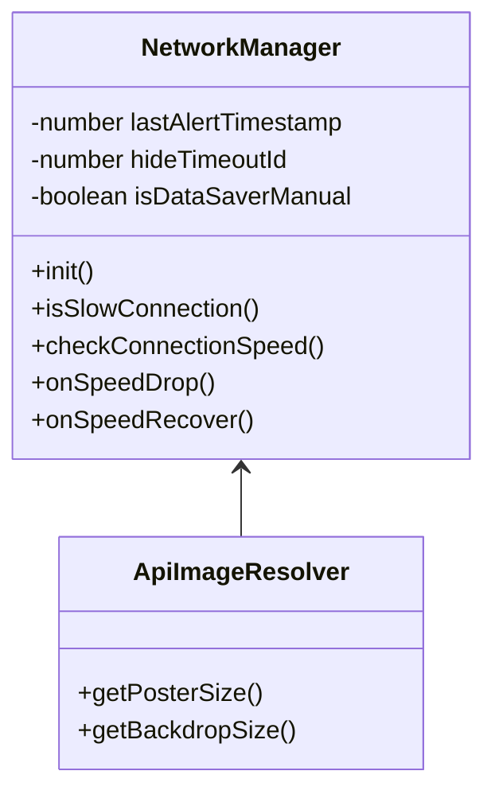
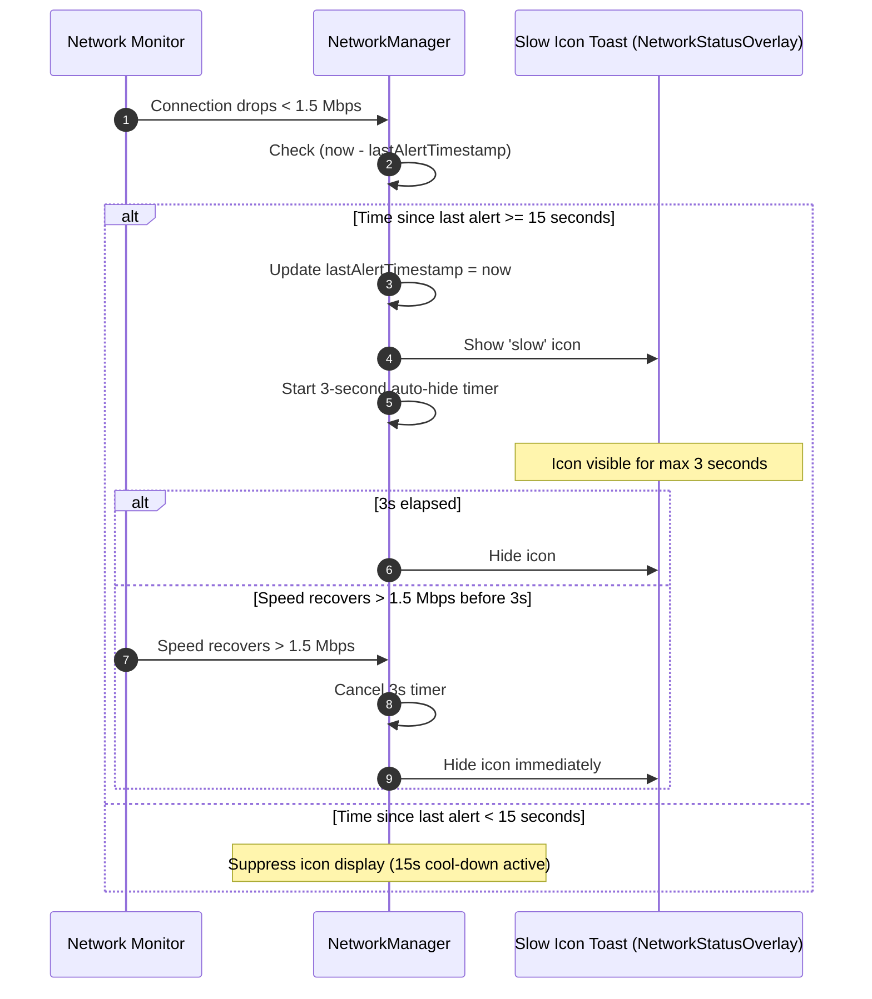

# Implementation Plan - Data Saver Mode & Slow Connection Indicator (15s Cool-Down)

## 1. Precise Requirements & Specification

### A. Data Saver Mode (Manual Toggle in Settings)
- **Visual UI**: NO header badges, NO orange icons, NO extra visual overlays.
- **Function**: When Data Saver is ON, the app strictly loads low-quality TMDb images (`w92` posters, `w300` backdrops).
- **Cache Invalidation**: Toggling Data Saver ON/OFF clears `imageCache` and invalidates resolution keys so views immediately load the target image resolution.

### B. Traag Netwerk Icoontje (Slow Connection Indicator & 15s Cool-Down Rule)
- **Trigger**: Network speed drops below 1.5 Mbps (`navigator.connection.downlink < 1.5` or `saveData`).
- **Low-Quality Image Loading**: When speed is below 1.5 Mbps, low-quality images (`w92` posters, `w300` backdrops) are automatically loaded (same image behavior as Data Saver).
- **Icon Display Duration (3 seconds)**: When a slow connection is detected, show the slow internet warning icon for **exactly 3 seconds**, then automatically hide it.
- **Immediate Hide on Speed Recovery**: If connection speed recovers above 1.5 Mbps before the 3 seconds elapse, hide the icon **immediately**.
- **15-Second Cool-Down Rule (Anti-Spam / Hysteresis)**:
  - If the connection drops below 1.5 Mbps again within 15 seconds of the previous alert (`now - lastAlertTime < 15000ms`), **DO NOT** show the slow internet icon again.
  - Only show the slow internet icon if the connection has remained stable above 1.5 Mbps for **longer than 15 seconds** before dropping below 1.5 Mbps again.

---

## 2. Architectural Design & OOP Principles

We will encapsulate connection monitoring, cool-down timer calculations, and toast display in `NetworkManager` and `NetworkStatusOverlay`.

### Component Responsibilities:
- `NetworkManager`: Tracks connection speed, handles 15-second cool-down window, auto-hides icon after 3 seconds, and provides unified `isSlowConnection()` query for `Api.js`.
- `ImageQualityResolver` / `Api`: Serves `w92` posters and `w300` backdrops if `dataSaver` is ON or `NetworkManager.isSlowConnection()` is true.

### Mermaid Class Diagram

### Mermaid Sequence Diagram (Slow Connection & 15s Cool-Down Flow)

---

## 3. Proposed Changes & Key Files

### [MODIFY] [app.js](file:///c:/Users/kenji/AndroidStudioProjects/IVIDS/app/src/main/assets/main/gui/js/app.js)
- Update network speed check logic (`checkSpeed`):
  - Track `lastSlowAlertTime` timestamp.
  - Implement 3-second auto-hide timer (`setTimeout`).
  - Implement 15-second cool-down logic (`now - lastSlowAlertTime >= 15000`).
  - Immediately hide icon if speed recovers above 1.5 Mbps.

### [MODIFY] [api.js](file:///c:/Users/kenji/AndroidStudioProjects/IVIDS/app/src/main/assets/main/logic/api.js)
- Ensure `Api.isSlowConnection()` returns true if `settings.dataSaver` is true OR `navigator.connection.downlink < 1.5`.
- Map slow connection to `w92` posters and `w300` backdrops.

### [MODIFY] [settings.js](file:///c:/Users/kenji/AndroidStudioProjects/IVIDS/app/src/main/assets/main/gui/pages/settings.js)
- Ensure manual `dataSaver` toggle in Settings ONLY affects image loading quality and clears `imageCache`. Does NOT trigger any header badges or orange icons.

---

## 4. Verification Plan

### Manual Verification
1. **Manual Data Saver Toggle Test**: Turn Data Saver ON in Settings. Confirm low-res images (`w92`/`w300`) load. Confirm **no icons or badges** appear on screen.
2. **Slow Connection 3s Display Test**: Simulate slow connection (< 1.5 Mbps). Confirm slow internet icon appears, stays for **3 seconds**, and disappears.
3. **15-Second Cool-Down Test**: Drop speed below 1.5 Mbps twice within 10 seconds. Confirm slow internet icon only appears on the **first** drop and is suppressed on the second drop.
4. **Immediate Recovery Test**: Drop speed below 1.5 Mbps, then recover speed > 1.5 Mbps after 1 second. Confirm icon disappears **immediately** (does not wait for 3s).
