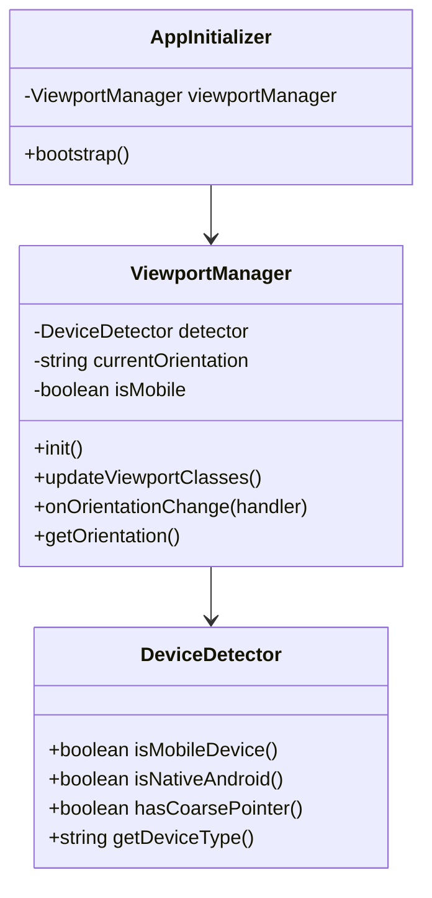
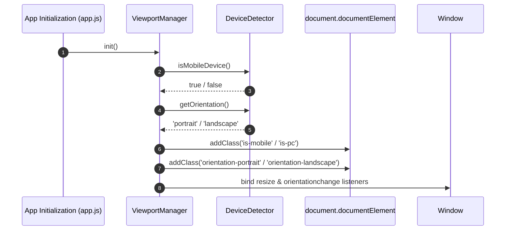

# Implementation Plan - Unique Mobile Mode & Mobile Landscape Architecture

## 1. Overview & Objectives

Currently, mobile responsiveness in IVIDS relies on a media query in `index.html`:
```html
<link rel="stylesheet" href="css/global-mobile.css" media="(max-aspect-ratio: 3/4)">
```
This approach causes two main issues:
1. **Desktop Window Resizing**: Resizing a desktop browser window to a narrow portrait aspect ratio incorrectly triggers mobile mode.
2. **Mobile Landscape Fallback**: Rotating a mobile device to landscape (aspect ratio > 3/4) loses mobile-specific UI elements (e.g. bottom navigation, touch targets, touch poster grids) and forces the desktop layout onto small touchscreens.

**Objective**: Establish a device-aware layout system where:
- **Mobile Mode** is strictly and uniquely applied to actual mobile devices (Android APK, Android WebViews, mobile browsers with touch input).
- **Mobile Landscape** has a custom layout tailored specifically for landscape mobile devices (e.g. compact sidebar, optimized hero, touch-friendly 2-column detail view), completely distinct from PC Desktop Landscape.
- **PC Mode** maintains the desktop layout regardless of window aspect ratio.

---

## 2. Architectural Design & OOP Principles

We will implement a modular, Object-Oriented `DeviceManager` and `ViewportController` to detect platform capability and manage viewport classes on the `<html>` root element.

### Component Responsibilities:
- `DeviceDetector`: Encapsulates detection logic (User-Agent parsing, touch/pointer capability queries, native Android WebView bridge check).
- `ViewportManager`: Listens for window resize and device orientation events, updates CSS classes on `<html>` (`.is-mobile`, `.is-pc`, `.orientation-portrait`, `.orientation-landscape`), and dispatches device state change events.

### Mermaid Class Diagram



### Mermaid Sequence Diagram (Device State Setup Flow)



---

## 3. Proposed Changes & Key Files

### [NEW] [mobile_mode_landscape_plan.md](file:///c:/Users/kenji/AndroidStudioProjects/IVIDS/docs/mobile_mode_landscape_plan.md)
Documentation plan file for unique mobile device mode and landscape layout.

### [NEW] [device-manager.js](file:///c:/Users/kenji/AndroidStudioProjects/IVIDS/app/src/main/assets/main/gui/js/device-manager.js)
- Encapsulates `DeviceDetector` and `ViewportManager` OOP classes.
- Detects touch capability (`window.matchMedia('(pointer: coarse)').matches` or `navigator.maxTouchPoints > 0`), User-Agent keywords, and `window.AndroidInterface`.
- Sets root CSS classes:
  - `html.is-mobile.orientation-portrait`
  - `html.is-mobile.orientation-landscape`
  - `html.is-pc`

### [MODIFY] [index.html](file:///c:/Users/kenji/AndroidStudioProjects/IVIDS/app/src/main/assets/main/gui/index.html)
- Remove `media="(max-aspect-ratio: 3/4)"` from `global-mobile.css`.
- Add `global-mobile-landscape.css` stylesheet reference.
- Load `device-manager.js` early during application startup.

### [MODIFY] [global-mobile.css](file:///c:/Users/kenji/AndroidStudioProjects/IVIDS/app/src/main/assets/main/gui/css/global-mobile.css)
- Scope mobile portrait rules under `html.is-mobile.orientation-portrait`.

### [NEW] [global-mobile-landscape.css](file:///c:/Users/kenji/AndroidStudioProjects/IVIDS/app/src/main/assets/main/gui/css/global-mobile-landscape.css)
- Dedicated CSS for mobile devices held in landscape orientation (`html.is-mobile.orientation-landscape`).
- Features:
  - Compact vertical bottom navigation or left slim touch sidebar with touch targets (min 48px).
  - Reduced hero height (35vh) to preserve row visibility on wide short viewports.
  - 2-column stacked details layout optimized for landscape touch control.
  - Horizontal scrolling row adjustments for lower landscape heights.

---

## 4. Coding & Styling Standards Compliance

- **No Translate Transforms**: Hover and focus indicators will strictly use border emphasis (`border: 2px solid white` or `border-color: var(--primary-color)`). No `translateX` / `translateY` animations.
- **External CSS Only**: All landscape rules placed strictly inside `css/global-mobile-landscape.css`.
- **Code Comments**: Document all CSS block selectors and Javascript class methods.

---

## 5. Implementation Task List Notice

> [!NOTE]
> An active task tracking list (`task.md` artifact) will be created and dynamically updated throughout the implementation phases of this feature.

---

## 6. Verification Plan

### Automated & Lint Verification
1. Run `node build.bat` to verify script compilation, version incrementing, and asset integrity.

### Manual Verification
1. **PC Browser Test**: Resize browser window to portrait aspect ratios; verify that PC navigation and desktop layout (`html.is-pc`) remain active without switching to mobile mode.
2. **Mobile Portrait Test**: Open app on Android emulator/device in portrait; verify `html.is-mobile.orientation-portrait` triggers bottom navigation bar and mobile portrait layout.
3. **Mobile Landscape Test**: Rotate Android emulator/device to landscape; verify `html.is-mobile.orientation-landscape` activates the unique mobile landscape view (compact bottom/side bar, compact hero, multi-poster row visibility) instead of PC desktop view.
